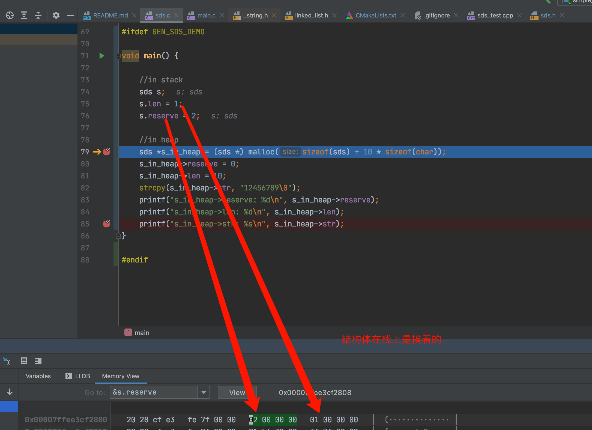
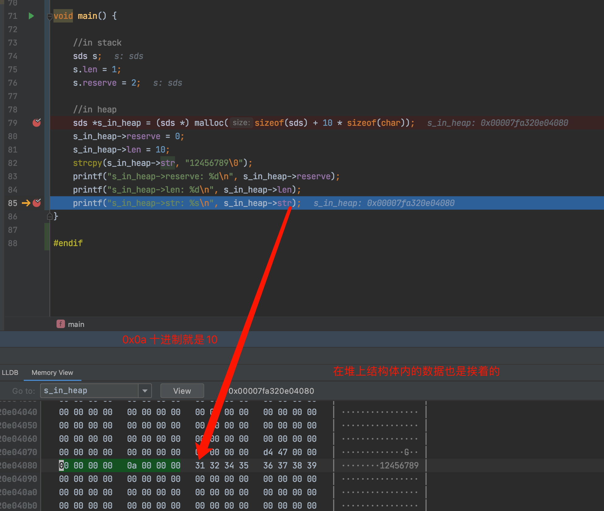

# SimpleRedis 

## SimpleRedis用途以及目标

* 研究学习Redis的数据结构以及代码实现
* 研究epoll跟libev 
* 字符串只支持ANSI-C style，原版Redis使用宏支持UTF-8等各种编码集，不利于学习研究

## 数据结构以及文档解释

### SDS字符串的实现

```c 
typedef struct SDS {
    int reserve;// reserve heap space
    int len; // length of str
    char str[];
} SDS;
```

* 此处struct sds使用了C语言的结构体特性，无论结构体是创建在栈上还是堆上 ，结构体的占据的内存空间都是连续的

* 下图LLDB调试，可以看到结构体在内存中存储的位置都是连续的，也就是说保存了结构体中的str指针之后，
  通过str指针的偏移计算是可以得到整个结构体的指针以及结构体中其它成员变量的指针的，
  这也是Redis里面sds字符串实现依赖C语言的一个特性





* tip: 注意作者使用的Mac的intel CPU为小端序，读数据都是从低地址开始的
  
* 读者可以自行调试，修改CmakeLists.txt代码如下，编译demo

```cmake
#for generate demo
add_definitions(-DGEN_DEMO)
add_definitions(-DGEN_SDS_DEMO)
```


